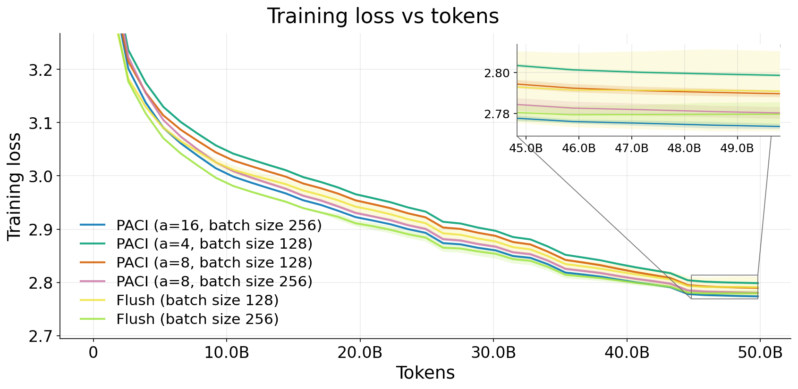
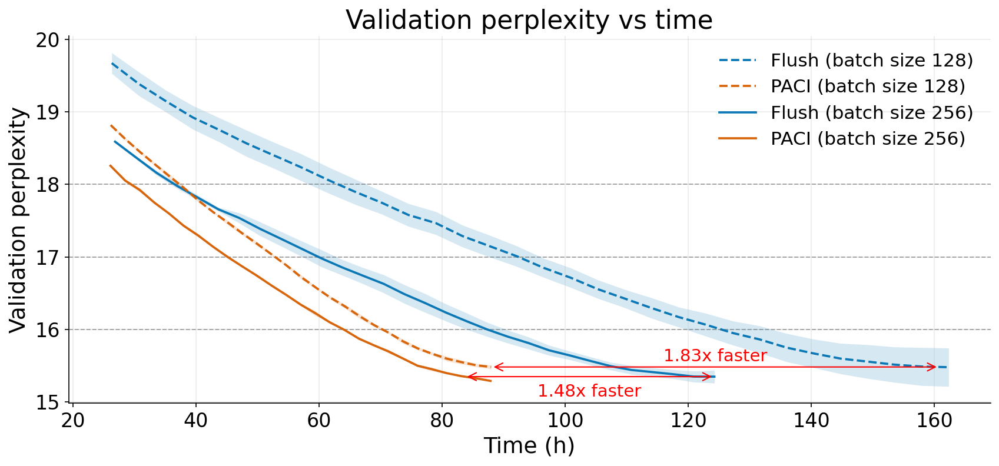

# Breaking the Bubble

Official PyTorch implementation of **PACI** (Pipeline Asynchronous training with Controlled Inconsistency), from *[Breaking the Bubble: Asynchronous Pipeline Parallel Training with Bounded Weight Inconsistency](https://arxiv.org/abs/2606.07881)*.

Pipeline parallelism is essential for training large models, but existing schedules trade off throughput, memory, and optimization consistency. Synchronous pipelines such as 1F1B-flush preserve forward/backward weight consistency but leave GPUs idle during pipeline bubbles. Asynchronous pipelines remove bubbles but introduce weight-version mismatch between a micro-batch's forward and backward passes.

**PACI** is a bubble-free asynchronous 1F1B schedule that bounds this mismatch using local gradient accumulation as a version-control mechanism. By slowing how fast parameter versions advance relative to pipeline delay, PACI limits how many optimizer updates any in-flight micro-batch crosses, without weight stashing, prediction, extra parameter copies, or global synchronization.

On GPT-2 Medium pretraining from scratch on OpenWebText (8-stage pipeline parallelism, ~50B tokens), PACI matches the loss dynamics and final validation perplexity of synchronous 1F1B-flush at the same peak memory, while achieving fully utilized pipeline throughput. PACI reaches the same perplexity levels earlier in wall-clock time, with up to **1.69x** faster time-to-accuracy vs. the best flush baseline at batch size 128 and **1.41x** at batch size 256.

<table>
  <tr>
    <td width="50%" align="center">
      
    </td>
    <td width="50%" align="center">
      
    </td>
  </tr>
  <tr>
    <td align="center">
      <em>
        Training loss versus processed tokens for 1F1B-flush and PACI under different accumulation factors. Bounded forward/backward inconsistency produces loss trajectories that closely track the synchronous baseline, with no evidence of instability or divergence.
      </em>
    </td>
    <td align="center">
      <em>
        Validation perplexity versus wall-clock time: PACI reaches shared perplexity levels earlier than 1F1B-flush. Arrows show PACI's time-to-accuracy speedup over 1F1B-flush when using the same number of microbatches, at the lowest perplexity reached by both methods
      </em>
    </td>
  </tr>
</table>

This repo provides PACI and a synchronous **1F1B-flush** baseline in a shared pipeline-parallel runtime.

## Installation

Requires Linux, NVIDIA GPUs, and Miniconda3 installed at `~/miniconda3` (`build_enviroment.sh` assumes this path).

```bash
cd installation
bash build_enviroment.sh
source ~/.bashrc
conda activate PACI
```

### Custom PyTorch 2.4.0 build

PACI requires a patched PyTorch 2.4.0 wheel. PyTorch tracks a per-tensor **version counter** that increments on in-place updates; during `backward()`, autograd checks that each tensor's version still matches what was recorded in the forward pass. Under asynchronous pipeline stepping, optimizer updates can advance parameter versions while earlier micro-batches are still in flight, so those checks fail and training cannot proceed.

The patch adds a `freeze_version_update` flag that skips version-counter increments during in-place parameter updates. PACI enables this around optimizer steps via `torch.set_freeze_version_update()` (see `DistPACI/Workers.py`). Patched sources are in `installation/modified_torch/2.4.0/`; `install_mod.sh` applies them before the build.

**Option A: build in Docker** (recommended):

```bash
cd installation/modified_torch
bash run_docker.sh
```

This script builds the `modified-torch-build:2.4.0` image, then starts a GPU-enabled container with `installation/modified_torch/` mounted at `/workspace`. The container runs `custom_builder.sh torch 2.4.0`; when the build finishes, the wheel appears in `installation/modified_torch/` on the host. Requires Docker with NVIDIA support.

**Option B:  build on the host** (requires CUDA, cuDNN, and build tooling):

```bash
cd installation/modified_torch
bash custom_builder.sh torch 2.4.0
cd ..
bash install_requirements.sh
```

The wheel is written to `installation/modified_torch/torch-2.4.0-cp39-cp39-linux_x86_64.whl`, which `install_requirements.sh` installs automatically.

Then install the rest of the dependencies:

```bash
cd installation
bash install_requirements.sh
```

## Usage

### GPT-2 Medium pretraining

The paper trains GPT-2 Medium on OpenWebText with 8-stage pipeline parallelism, sequence length 1024, AdamW, and global batch sizes 128/256. Defaults in `TrainGPT.py` match this setup when run on 8 GPUs.

```bash
python TrainGPT.py
```


| Option              | Default                | Description                                                             |
| ------------------- | ---------------------- | ----------------------------------------------------------------------- |
| `pipeline_mode`     | `PipelineMethods.paci` | `PipelineMethods.flush` for the 1F1B-flush baseline                     |
| `grad_accumulation` | `8`                    | Accumulation factor *a* (inconsistency bound)                           |
| `global_batch_size` | `256`                  | Global batch size                                                       |
| `paci_mode`         | `PACIMode.perf`        | `PACIMode.mem` for lower activation memory via activation recomputation |


`split_to` is set to `torch.cuda.device_count()`. Tokenized data is cached under `./cache/openwebtext/`; checkpoints and logs go to `./outputs/<run_name>/`.

`base_*` hyperparameters are defined at `base_global_batch_size = 256`. Changing `global_batch_size` rescales the learning rate (sqrt rule) and step counts to keep the token budget comparable.

### Throughput benchmarks

```bash
cd BenchmarkSpeed
python SpeedGPT.py
```

Configure sweeps in the `if __name__ == '__main__':` block. Results are saved to `BenchmarkSpeed/plots/<gpu_name>/*.csv`.

## Repository structure

```
DistPACI/             Pipeline runtime (workers, P2P comms, PACI/flush scheduling)
TrainGPT.py           GPT-2 pretraining entry point
LLModelTraininer.py   Training loop, evaluation, checkpointing
Models/               GPT-2 model definitions
DataLoaders/          OpenWebText loading and caching
BenchmarkSpeed/       Throughput and memory sweeps
installation/         Conda env, requirements, custom PyTorch build
```

## Citation

```bibtex
@misc{elam2026breakingbubbleasynchronouspipeline,
      title={Breaking the Bubble: Asynchronous Pipeline Parallel Training with Bounded Weight Inconsistency}, 
      author={Itay Elam and Eliron Rahimi and Avi Mendelson and Chaim Baskin},
      year={2026},
      eprint={2606.07881},
      archivePrefix={arXiv},
      primaryClass={cs.LG},
      url={https://arxiv.org/abs/2606.07881}, 
}
```

## Acknowledgments

Optimizer grouping follows patterns from [pre-training-gpt2](https://github.com/minhnguyent546/pre-training-gpt2).

Model implementation adapted from [gpt2-from-scratch](https://github.com/saqib1707/gpt2-from-scratch).
